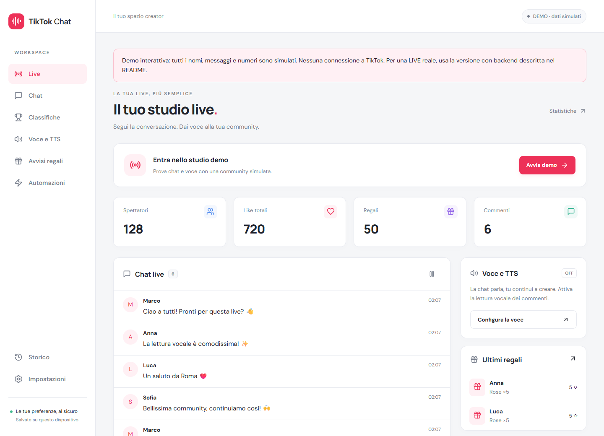
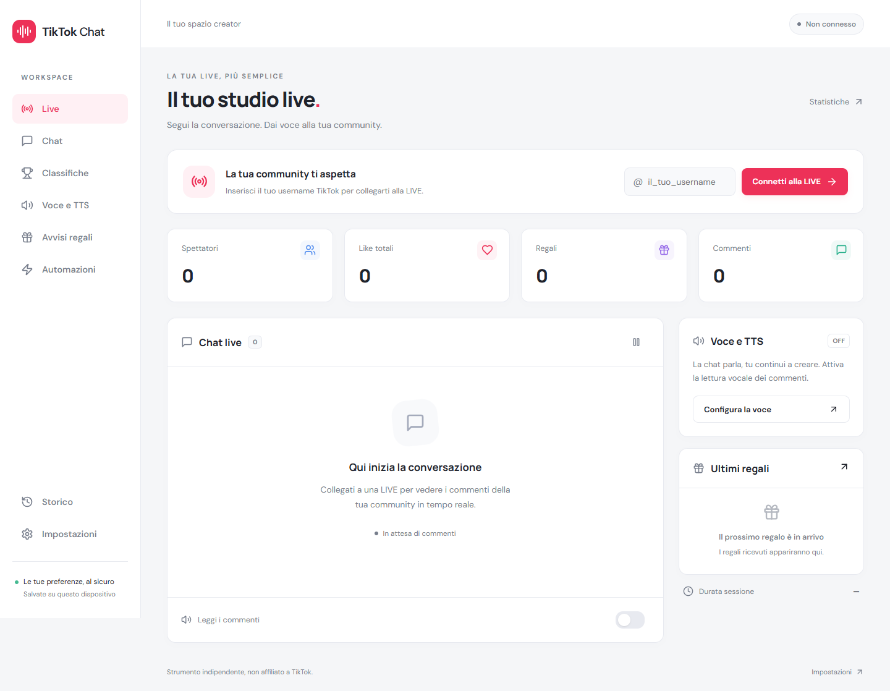
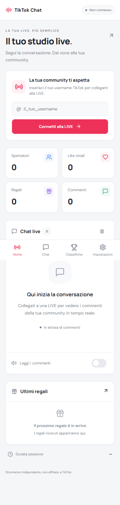

# TikTok Chat — lettura commenti TikTok LIVE, voce e regali

TikTok Chat è un'app web per leggere commenti e chat TikTok LIVE, ascoltare i messaggi con la sintesi vocale (TTS), gestire regali e visualizzare classifiche in tempo reale.

**[Apri l’app online](https://hugoreynoso.github.io/utility-tiktok-chat/)** · **[Repository GitHub](https://github.com/HugoReynoso/utility-tiktok-chat)**

## App pubblica, Render e refresh

La versione pubblicata su GitHub Pages è ora l’app reale: `frontend/.env.pages` imposta `VITE_DEMO=false` e `VITE_API_URL=https://tiktok-chat-9pox.onrender.com`. Inserisci lo username di un account attualmente in LIVE per collegarti. L’URL del backend è pubblico; la chiave di firma TikTok resta esclusivamente su Render.

GitHub Pages ospita il frontend statico; il backend Node è ospitato su Render. [Health check backend](https://tiktok-chat-9pox.onrender.com/api/health). Un health check positivo non garantisce che TikTok accetti una specifica LIVE.

### Refresh e link diretti

La navigazione pubblica usa il router hash indipendentemente dalla modalità demo, tramite `VITE_ROUTER_MODE=hash`. Link come [Chat](https://hugoreynoso.github.io/utility-tiktok-chat/#/chat) e [Classifiche](https://hugoreynoso.github.io/utility-tiktok-chat/#/rankings) funzionano anche dopo F5 o apertura in una nuova scheda. I vecchi link `/utility-tiktok-chat/chat` e `/utility-tiktok-chat/live` vengono convertiti dai browser tramite `404.html`; per nuovi collegamenti usa sempre gli URL con `#/`.

Il refresh ricarica l’app: non mantiene la connessione TikTok né i dati di sessione in memoria. Le impostazioni locali restano salvate; premi di nuovo Connetti alla LIVE per aprire una nuova sessione. La riproduzione audio richiede comunque un gesto dell’utente.

### Connessione robusta

- WebSocket è il primo trasporto; `tryAllTransports: true` permette di provare realmente HTTP polling quando WebSocket non è disponibile.
- Timeout iniziale di 60 secondi per consentire il risveglio del servizio Render, con massimo 5 riconnessioni e ritardo progressivo da 2 a 10 secondi, con jitter.
- Durante i tentativi l’app mostra Riconnessione; una volta esauriti torna a uno stato di errore con possibilità di riprovare manualmente.
- Disconnetti chiude il trasporto, annulla i tentativi automatici e libera la sessione server. Non accoda comandi da inviare alla connessione successiva.
- Senza `VITE_API_URL`, lo sviluppo locale usa il proxy Vite della stessa origine: funziona anche aprendo il frontend dal telefono sulla LAN, se l’origine è autorizzata sul backend.

Le voci TTS dipendono dal browser. Interruzioni e riavvii del backend possono perdere eventi o aprire una nuova sessione; non viene promessa continuità dei contatori durante un’interruzione.

### Preview per il tuo sito



- File PNG: `frontend/public/preview/tiktok-chat-preview.png` (1440 × 1040 pixel).
- [Scarica/apri l’immagine pubblica](https://hugoreynoso.github.io/utility-tiktok-chat/preview/tiktok-chat-preview.png).
- È una cattura della precedente modalità demo: i dati nell’immagine sono simulati. L’app pubblicata ora usa gli eventi reali del backend.

Esempio di collegamento dal tuo sito:

```html
<a
  href="https://hugoreynoso.github.io/utility-tiktok-chat/"
  target="_blank"
  rel="noopener noreferrer"
>
  
</a>
```

### Pubblicazione GitHub Pages

Il workflow `.github/workflows/pages.yml` compila e pubblica l’app ad ogni push su `main`. Usa Node 24, `npm ci` e `npm run build:demo`. Questo comando conserva il nome storico, ma usa la configurazione `.env.pages`, ora collegata a Render. La sorgente Pages nelle impostazioni del repository deve essere **GitHub Actions**.

`frontend/.env.pages` configura il percorso `/utility-tiktok-chat/`, il backend Render e il router hash (`#/chat`). `frontend/.env.production` contiene l’URL per la build normale. `npm run dev` usa il proxy locale se `VITE_API_URL` non è specificato.

```sh
npm run build:demo
npm run preview:demo -w frontend
# Apri http://localhost:4173/utility-tiktok-chat/
```

Per rigenerare l’immagine simulata, imposta temporaneamente la variabile d’ambiente `VITE_DEMO=true` prima della build. Con l’anteprima attiva e Playwright/Edge disponibili, esegui `node scripts/preview-demo.cjs`. Se necessario, imposta `PLAYWRIGHT_MODULE` al percorso del modulo Playwright. Non mantenere l’override demo quando pubblichi la versione reale.

Web app mobile-first per leggere e ascoltare la chat di TikTok LIVE, visualizzare regali e classifiche. Vue 3 + TypeScript + Vite + Pinia + Vue Router, backend Node.js + Express + Socket.IO + `tiktok-live-connector`. Nessun database, nessun dato dimostrativo mescolato ai dati reali.

## Avvio rapido

Requisiti: Node.js 22.12+ (consigliato Node 24 LTS), npm 10+, connessione Internet e un account TikTok **attualmente in LIVE** da osservare. Non è necessario fare login nell’app.

```sh
npm install
npm run dev
```

Apri http://localhost:5173. Inserisci lo username, ad esempio `@creator`, premi **Connetti alla LIVE**, poi attiva la lettura vocale dalla chat. Il pulsante di connessione inizializza anche l’audio del browser.

Il comando root avvia contemporaneamente frontend (5173) e backend (3001). Per fermarli: Ctrl+C. Se le porte sono occupate, libera le porte o aggiorna proxy/configurazione in modo coerente.

### Avvio separato

Esegui prima `npm install` nella root: è un monorepo npm workspaces e usa un unico `package-lock.json`.

```sh
# Terminale 1, dalla root
npm run dev -w backend
# Terminale 2, dalla root
npm run dev -w frontend
```

### Compilazione e test

```sh
npm run build
npm test
```

La build verifica TypeScript su backend e frontend. L’output è in `frontend/dist` e `backend/dist`. `npm run start -w backend` esegue il backend compilato. Il frontend in produzione richiede un server statico con fallback SPA e proxy `/socket.io` (incluso upgrade WebSocket) e `/api` verso il backend. `vite preview` serve solo per anteprima, non configura il proxy di produzione.

## Funzionalità implementate

- Connessione tramite username con validazione, stato LIVE, disconnessione, fine diretta e tre tentativi di riconnessione TikTok con ritardo progressivo.
- Una connessione TikTok e una sessione in memoria per client Socket.IO. Nessuna chat o credenziale salvata su server.
- Chat con avatar disponibili, orario, scorrimento automatico e pausa; massimo 500 messaggi.
- TTS Web Speech API: voce del dispositivo, lingua, velocità, pitch, volume, lettura nome, pausa tra messaggi, interruzione audio. Coda limitata a 30 messaggi; quelli in eccesso non vengono letti.
- Filtri tutti/follower/abbonati/parole incluse, blacklist di parole separate da righe o virgole. I messaggi filtrati restano in chat.
- Regali e conteggio finale delle combo; deduplicazione tramite gruppo regalo o ID messaggio.
- Tre suoni sintetizzati con Web Audio: campanello, carillon, celebrazione. Regole persistenti regalo → suono/testo, quantità minima a fine combo, follow/share → suono/testo. Massimo 50 regole, attivabili e rimovibili.
- Ringraziamento vocale opzionale dei nuovi follower.
- Spettatori, picco, like totali comunicati da TikTok, like rilevati per utente, commenti, regali, diamanti, follow e share rilevati.
- Classifiche regali, like rilevati, supporto totale; dettaglio regali per utente. Pesi configurabili: like 1, diamante 10, share 100, follow 200.
- Reset con conferma: salva il riepilogo precedente nello storico e azzera dati correnti senza eliminare le preferenze.
- Ultime 10 sessioni in localStorage, salvate alla disconnessione/fine LIVE/reset.
- Italiano, inglese e spagnolo tramite file i18n; tema sistema/chiaro/scuro persistente.
- Sidebar desktop e navigazione inferiore mobile; accesso a voce, alert, regole e storico anche da Impostazioni mobile.
- Manifest e icona SVG come base PWA.

## Screenshot

Le immagini mostrano lo stato iniziale, senza dati fittizi.





## Configurazione

Copia `backend/.env.example` in `backend/.env` se vuoi cambiare i valori predefiniti. Il file locale non è tracciato da Git.

| Variabile       | Predefinito           | Scopo                                                                 |
| --------------- | --------------------- | --------------------------------------------------------------------- |
| PORT            | 3001                  | Porta API                                                             |
| HOST            | 127.0.0.1             | Interfaccia backend                                                   |
| FRONTEND_ORIGIN | http://localhost:5173 | Origini browser ammesse, separate da virgole                          |
| SIGN_API_KEY    | vuoto                 | Chiave facoltativa del provider di firma del connettore, solo backend |

Vite inoltra `/socket.io` e `/api` al backend. Per provare dal telefono sulla stessa rete, apri `http://IP_DEL_PC:5173` e aggiungi questa origine a `FRONTEND_ORIGIN`, quindi riavvia il backend. Su dispositivi mobili alcune API richiedono HTTPS e l’app in primo piano: usare HTTPS per un test completo dell’audio e per una futura PWA.

Le preferenze usano `tiktok-chat:settings`, lo storico `tiktok-chat:history`. localStorage appartiene al browser e all’origine: non sincronizza dispositivi. La modalità privata, la pulizia dei dati o quota esaurita possono impedire la persistenza; l’app mostra un avviso.

I pesi iniziali del ranking sono in `frontend/src/stores/settings.ts` (`scoreConfig`). Il punteggio è calcolato dal client, non è un punteggio ufficiale TikTok.

## Struttura

```text
frontend/
  public/             Manifest e icona
  src/
    components/       ConnectionPanel, ChatPanel, StatsCard, VoiceSettings
    pages/            Workspace: le viste delle varie route
    stores/           Stato live/sessione e impostazioni persistenti
    services/audio.ts Coda TTS, filtri e regole audio
    locales/          it.json, en.json, es.json
    App.vue           Layout responsive e navigazione
    main.ts           Bootstrap, Pinia e routing
    style.css         Tema, componenti e layout mobile
backend/
  src/
    index.ts          HTTP, origini ammesse e Socket.IO
    socket/register.ts Gestione comandi del client
    services/TikTokLiveService.ts Connessione ed eventi TikTok
    models/Session.ts Contatori, ranking, deduplicazione
    utils/            Normalizzazione eventi e test
shared/types.ts       Contratti comuni e protocollo Socket.IO
scripts/smoke.cjs     Verifica browser opzionale (Playwright)
docs/                 Screenshot
```

Il modello Session è indipendente dal trasporto e dalla UI. Per aggiungere PostgreSQL si può introdurre un repository delle sessioni senza spostare la connessione TikTok nel controller. La V1 mantiene intenzionalmente pochi store e una sola vista organizzatrice; i componenti e i contratti sono già separati.

Route: `/`, `/live`, `/chat`, `/rankings`, `/alerts`, `/voice`, `/rules`, `/settings`, `/history`, `/statistics`.

Eventi client: `live:connect`, `live:disconnect`, `live:reset`. Eventi server: `live:status`, `live:connected`, `live:disconnected`, `live:stats`, `live:reset`, `live:ended`, `chat:message`, `gift:received`, `like:received`, `follow:received`, `share:received`, `viewer:update`. Snapshot statistiche/classifiche al massimo ogni 750 ms se cambiate. Commenti e alert sono emessi subito.

## Limiti importanti e lavoro successivo

1. Il connettore è **non ufficiale** e dipende da TikTok e dal provider di firma. TikTok può bloccare richieste, cambiare schema o applicare limiti. L’installazione non garantisce l’accesso a una LIVE; il provider può richiedere una chiave/piano. Consulta la [documentazione del connettore](https://github.com/zerodytrash/TikTok-Live-Connector). Gli errori esterni non vengono esposti integralmente al browser.
2. Il collegamento a una LIVE reale deve essere collaudato con uno username attualmente online. Build e test locali non verificano l’accessibilità di TikTok dalla rete dell’utente.
3. Eventi persi durante disconnessioni non sono recuperabili. Una riconnessione TikTok mantiene i contatori; una perdita della connessione browser/backend apre una nuova sessione. Il riavvio server perde lo stato in memoria. Chiudere forzatamente la scheda può perdere la sessione corrente non ancora archiviata.
4. Like totali e like rilevati sono diversi. Follow/share e informazioni follower/abbonato non sono garantiti. Se il ruolo non è disponibile, i relativi filtri TTS non leggono il messaggio. I dati non disponibili restano a zero e non vengono stimati.
5. Combo di tipo 1 sono conteggiate solo quando `repeatEnd` è vero/1. Una combo interrotta senza evento finale non viene stimata. Deduplicazione limitata agli ultimi 10.000 ID; classifiche limitate ai primi 10.000 utenti incontrati. I contatori globali proseguono, ma oltre questo limite non si creano altre righe utente.
6. La V1 include suoni sintetizzati; **upload/importazione MP3 non ancora implementati**. Le regole si possono attivare/eliminare; per cambiarne i campi, ricrearle. Se una regola follow vocale e il ringraziamento automatico sono entrambi attivi, vengono eseguiti entrambi.
7. Le voci dipendono dal sistema/browser. Su iOS/Android l’audio può interrompersi a schermo bloccato o in background. La coda TTS è limitata; non è garantita la lettura di tutti i messaggi in una LIVE ad alto traffico. Servono test su dispositivi reali.
8. Base PWA predisposta, **installabilità/offline non completati**: mancano service worker e icone PNG 192/512. Nessuna promessa di chat offline.
9. Progetto pensato per sviluppo locale/personale. Prima di pubblicarlo servono autenticazione, limiti globali di connessioni/eventi, HTTPS e un servizio Node persistente. Le origini ammesse non sostituiscono l’autenticazione. Non esporre chiavi nel frontend.
10. CSS usa Google Fonts con fallback di sistema. Se la rete blocca i font, l’interfaccia resta utilizzabile.

## Verifiche browser opzionali

Con frontend/backend già avviati e Playwright con Chromium disponibile, eseguire `node scripts/smoke.cjs`. Impostare `PLAYWRIGHT_MODULE` al percorso del modulo se non è installato localmente. Lo script verifica route, persistenza preferenze/regole, validazione username e assenza di overflow mobile; crea screenshot in `docs`. Non contatta TikTok né inventa interazioni LIVE.
